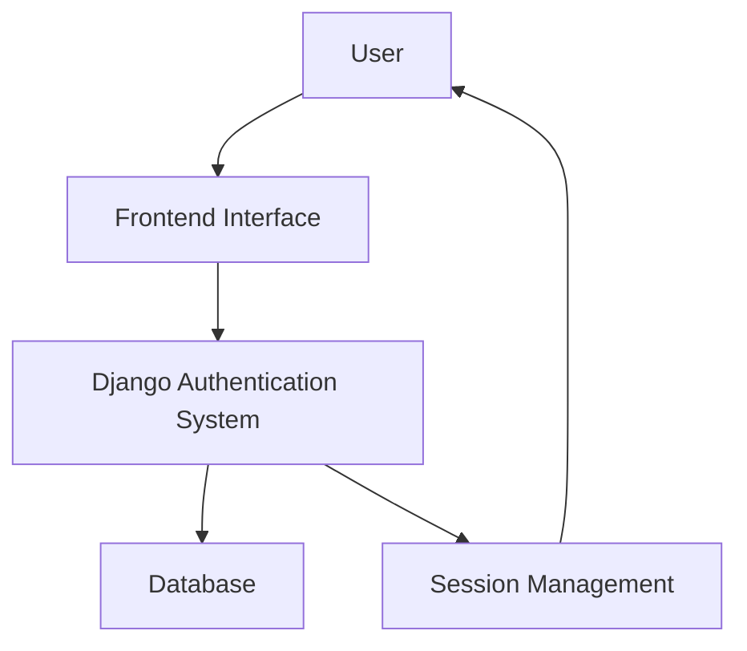
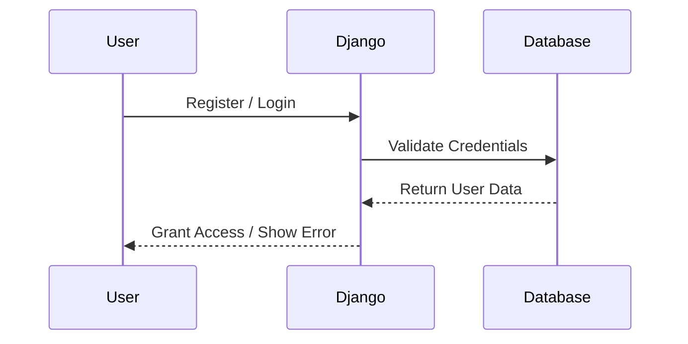

# SecureHub

<div align="center">

# SecureHub

### A Modern Secure Authentication & User Management System


**SecureHub** is a secure and modern authentication platform built with **Django**, designed to provide robust user authentication, profile management, and secure access control for web applications.

[Report Bug](https://github.com/ajsrabon99/SecureHub/issues) • [Request Feature](https://github.com/ajsrabon99/SecureHub/issues)

</div>

---

## 📌 Project Overview

SecureHub is a comprehensive authentication and user management system that focuses on **security, scalability, and user experience**. It provides essential features such as user registration, login, logout, password management, and profile handling, making it an ideal foundation for secure web applications.

---

## ✨ Key Features

* 🔑 Secure user registration and authentication
* 🔒 Login and logout functionality
* 👤 User profile management
* 🛡️ Password encryption and secure storage
* 📱 Responsive design for all devices
* ⚡ Fast and optimized Django backend
* 🎯 Clean and intuitive user interface
* 🚀 Scalable architecture for future enhancements

---

## 🏗️ System Architecture



---

## 🛠️ Tech Stack

| Category                 | Technology              |
| ------------------------ | ----------------------- |
| **Backend**              | Django                  |
| **Programming Language** | Python                  |
| **Frontend**             | HTML5, CSS3, JavaScript |
| **Database**             | SQLite                  |
| **Authentication**       | Django Auth System      |
| **Deployment**           | Render / Railway        |
| **Server**               | Gunicorn                |
| **Static Files**         | WhiteNoise              |

---

## 📂 Project Structure

```text
SecureHub/
│
├── securehub/              # Django project configuration
│   ├── settings.py
│   ├── urls.py
│   ├── wsgi.py
│   └── asgi.py
│
├── accounts/               # Authentication app
│   ├── templates/
│   ├── views.py
│   ├── forms.py
│   ├── models.py
│   └── urls.py
│
├── static/                 # CSS, JS, and images
├── templates/              # Global templates
├── manage.py
├── requirements.txt
└── .gitignore
```

---

## 📊 Authentication Workflow




---

## 📈 Project Statistics

| Metric                    | Value       |
| ------------------------- | ----------- |
| **Framework**             | Django      |
| **Language**              | Python      |
| **Authentication System** | Django Auth |
| **Responsive Design**     | Yes         |
| **Open Source**           | Yes         |
| **Deployment Ready**      | Yes         |

---

## 🚀 Future Enhancements

* Two-factor authentication (2FA)
* Email verification system
* Password reset via email
* Role-based access control
* User activity logs
* OAuth integration (Google, GitHub)
* Advanced security analytics

---

## 👨‍💻 Author

<div align="center">

### **AJ Srabon (Ashrafuzzaman)**

[GitHub](https://github.com/ajsrabon99) • [Portfolio](http://aj-srabon-portfolio.netlify.app/)

📧 **Email:** [ashrafuzzamansrabon@gmail.com](mailto:ashrafuzzamansrabon@gmail.com)

</div>

---

## ⭐ Support

If you find this project useful, please consider giving it a **Star ⭐** on GitHub. Your support helps improve the project and motivates further development.

---

## 📄 License

This project is licensed under the **MIT License**. Feel free to use and modify it for personal or commercial purposes.

---

<div align="center">

### Made with ❤️ by AJ Srabon

**Thank you for visiting this repository!**

</div>
